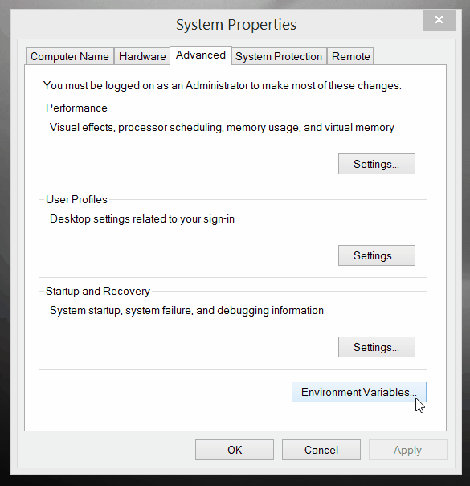

# Environment Variables

Environment variables allow you to use sensitive or secret information (credentials, passwords, tokens, etc.) in a script without hard-coding those values into your script. Typically, you won't want to store something like a password as a string directly in your code. If you commit that code to GitHub it becomes a permanent part of your code's history and thus accessible to anyone who accesses your project on GitHub. There are web crawlers that sift through GitHub repositories looking for information like this, so be careful.

### Setting Environment Variables

Environment variables are set differently on different operating systems. On Windows, just type 'environment variables' into the start menu and open the System Properties dialog box ('Advanced' tab). Click on 'Environment Variables' to edit. Adding as a user variable, rather than a system variable, is generally sufficient. Conventionally, both the name and the value are uppercase.




### Using Environment Variables

Python reads the environment variables when `os` is imported. Environment variables are passed as a dictionary. Since this is simply a dictionary, you can use `os.environ.get('<KEY>')` to access the value with the name of the variable (where `'<KEY>'` is the name you specified for the environment variable). For example:

```python
import os

my_password = os.environ.get('PASS_KEY')
```

### A caveat

Environment variables are commonly used, but [not always the best option](https://blog.dnsimple.com/2018/05/using-environment-as-configuration/ ) for storing secrets. They can be subject to mangling by the operating system, and some access tokens don't conform to their limitations (e.g., my google access token had a '=' character, which is not allowed). Especially if your secrets are stored as a JSON blob, you might consider saving them in a file and reading them directly from the file. I will add a `secrets/` folder to my projects and save credentials there. MAKE SURE TO INCLUDE `secrets/` IN YOUR `.gitignore` FILE!

Use the `google-auth` or `oauthlib` packages to access and use credentials stored as a JSON file.

