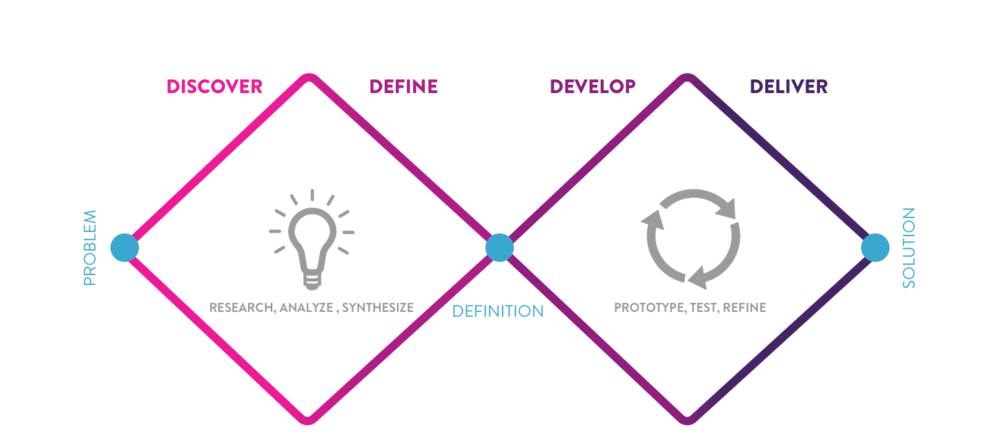

# Step 5: Identify a Solution

This is the fun part! In terms of the design ‘**double diamond**,’ we are at the central convergence point. Starting from our vision, we’ve diverged to explore the problem space and its stakeholders, and have since converged around a problem worth solving. Now, we get to come up with a solution. Call it **brainstorming** or **ideation** or, my personal favorite, **spitballing**. Just don’t take it too seriously and don’t do it alone. 

There are a plethora of techniques for working in groups to create solutions. Can you invest in a weeklong **design sprint**? If not, try [this]() one day version. Use **sketching** to help you visualize the solution. **Timed idea generation**, **mind mapping**, **storyboarding**, **journey maps** are all great options to get a creative buzz on. Reframe your problem scenarios into opportunities by asking ‘**how might we?**’.

Think about the problem from multiple angles. **Create frameworks** to help you see the problem with a different lens. Use **many model thinking**. Consider both **extremes and mainstreams**. Try coming up with your **worst idea**. Look at similar projects or other people’s interventions and describe their **challenges, insights, and opportunities**. Consider the problem and **define success**--what would a good solution look like?

You’re looking for a solution that is all three: **desirable, feasible, viable**. Ideally one that also gets people in your group excited and overlaps with your **unique strengths**.

Once you’ve arrived at a potential conceptual solution, it’s time to put it to the test. For the people for whom you’re trying to solve this problem, craft a **value proposition** for each of the problem scenarios you’ve already defined. Also include the current alternative so you know what you’re competing against.

|               Problem Scenarios               |       Alternatives       |      Value Propositions      |
| :-------------------------------------------: | :----------------------: | :--------------------------: |
| What is the problem, need, or job to be done? | What are they doing now? | Why is your solution better? |

Does the solution appear to be better than the alternative? How do you know? Do you need to test the value proposition to know for sure? Craft **value hypotheses** for each value proposition that should be tested. You can state a value hypothesis as “If we do X for Y, they will Z”. Make sure the behavior you want to see is observable. Some value hypotheses can be tested without building any of the proposed solution, others will require a **minimum viable product** to test--we’ll work on that in the next step. 

Finally, it’s good practice to summarize the value of your solution in a **positioning statement**. Fill in the blanks: For [persona A] who need to [problem scenario], our [solution name] is a [product category] that [value proposition]. Unlike [current alternative], our product [key differentiation]. Draft one for each of your primary personas.

Now is also the time to develop a **Results Chain** to clarify assumptions as to why solving this problem will improve the conservation target and identify **metrics** for evaluating progress.