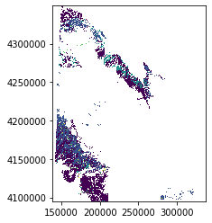
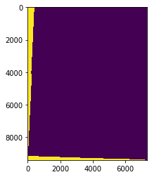

This notebook is a test for classifying ecological sites based on their state and transition model on the west slope of Colorado.

Naive Bayes classifier developed from Chris Holden's helpful example, as updated by Patrick Gray, at http://patrickgray.me/open-geo-tutorial/chapter_5_classification.html


```python
import rasterio
from rasterio.plot import show
from rasterio.plot import reshape_as_raster, reshape_as_image
import geopandas as gpd
import numpy as np
from shapely.geometry import mapping
from sklearn.naive_bayes import GaussianNB
import matplotlib.pyplot as plt
%matplotlib inline
```


    ---------------------------------------------------------------------------

    AttributeError                            Traceback (most recent call last)

    <ipython-input-4-7bcbad8eeaba> in <module>
          2 from rasterio.plot import show
          3 from rasterio.plot import reshape_as_raster, reshape_as_image
    ----> 4 import geopandas as gpd
          5 import numpy as np
          6 from shapely.geometry import mapping
    

    ~\Anaconda3\lib\site-packages\geopandas\__init__.py in <module>
    ----> 1 from geopandas.geoseries import GeoSeries
          2 from geopandas.geodataframe import GeoDataFrame
          3 
          4 from geopandas.io.file import read_file
          5 from geopandas.io.sql import read_postgis
    

    ~\Anaconda3\lib\site-packages\geopandas\geoseries.py in <module>
          3 
          4 import numpy as np
    ----> 5 from pandas import Series
          6 import pyproj
          7 from shapely.geometry import shape, Point
    

    ~\Anaconda3\lib\site-packages\pandas\__init__.py in <module>
         53 import pandas.core.config_init
         54 
    ---> 55 from pandas.core.api import (
         56     # dtype
         57     Int8Dtype,
    

    ~\Anaconda3\lib\site-packages\pandas\core\api.py in <module>
          3 import numpy as np
          4 
    ----> 5 from pandas.core.arrays.integer import (
          6     Int8Dtype,
          7     Int16Dtype,
    

    ~\Anaconda3\lib\site-packages\pandas\core\arrays\__init__.py in <module>
          5     ExtensionScalarOpsMixin,
          6 )
    ----> 7 from .categorical import Categorical  # noqa: F401
          8 from .datetimes import DatetimeArray  # noqa: F401
          9 from .integer import IntegerArray, integer_array  # noqa: F401
    

    ~\Anaconda3\lib\site-packages\pandas\core\arrays\categorical.py in <module>
         50 from pandas.core import ops
         51 from pandas.core.accessor import PandasDelegate, delegate_names
    ---> 52 import pandas.core.algorithms as algorithms
         53 from pandas.core.algorithms import factorize, take, take_1d, unique1d
         54 from pandas.core.base import NoNewAttributesMixin, PandasObject, _shared_docs
    

    AttributeError: module 'pandas' has no attribute 'core'


We'll use the Rangelands App dataset, which includes cover estimates for tree, shrub, perennial grass and forbs, bare ground, and ? as predictor features. The training data is the mapped STM derived from NRCS data.


```python
# Read in features and training data
train_path = r'D:\ArcGIS\Colorado\General\Rangelands_App\for-analysis\train_clip_utm.tif'
data = rasterio.open(train_path)
data.crs
```


    CRS({'init': 'epsg:26913'})


```python
data.name
```


    'D:\\ArcGIS\\Colorado\\General\\Rangelands_App\\for-analysis\\train_clip_utm.tif'


```python
labels_path = r'D:\ArcGIS\Colorado\General\Rangelands_App\for-analysis\classes_utm.tif'
labels = rasterio.open(classes_path)
labels.crs
```


    CRS({'init': 'epsg:26913'})


```python
data.shape
```


    (9257, 7221)


```python
labels.shape
```


    (9257, 7221)


```python
data.count
```


    6


```python
show(labels)
```





    <matplotlib.axes._subplots.AxesSubplot at 0xc520df4160>


```python
data.shape
```


    (9257, 7221)


```python
X = data.read()
```


```python
X = X.reshape(-1, 6)
X.shape
```


    (66844797, 6)


```python
y = labels.read()
```


```python
y = y.reshape(-1, 1)
y.shape
```


    (66844797, 1)


```python
gnb = GaussianNB()
gnb.fit(X, y.ravel()) #https://stackoverflow.com/questions/34165731/a-column-vector-y-was-passed-when-a-1d-array-was-expected
```


    GaussianNB(priors=None, var_smoothing=1e-09)


```python
range_path = r'D:\ArcGIS\Colorado\General\Rangelands_App\for-analysis\range_clip_utm.tif'
range_clip = rasterio.open(range_path)
```


```python
range_reshaped = reshape_as_image(range_clip.read())
```


```python
range_reshaped.shape
```


    (9412, 7341, 6)


```python
class_prediction = gnb.predict(range_reshaped.reshape(-1,6))
class_prediction = class_prediction.reshape(range_reshaped[:, :, 0].shape)
```


```python
class_prediction
```


    array([[255, 255, 255, ...,   5,   5,   5],
           [255, 255, 255, ...,   5,   5,   5],
           [255, 255, 255, ...,   5,   5,   5],
           ...,
           [255, 255, 255, ..., 255, 255, 255],
           [255, 255, 255, ..., 255, 255, 255],
           [255, 255, 255, ..., 255, 255, 255]], dtype=uint8)


```python
show(class_prediction)
```





    <matplotlib.axes._subplots.AxesSubplot at 0xc520e7a390>


```python

```
